# Netbour


# Javier J. Medinilla Agüera


## Índice

1. [Introducción](#introducción)
2. [Objetivos del proyecto](#objetivos-del-proyecto)
3. [Planificación del proyecto](#planificación-del-proyecto)
	- Costes
4. [Análisis y diseño del sistema](#análisis-y-diseño-del-sistema)
	- Diagrama de la base de datos y entidades
	- Diccionario de datos
	- Ejemplos de consultas a la base de datos
5. [Especificaciones del sistema](#especificaciones-del-sistema)
	- Justificación de las herramientas utilizadas
	- Especificaciones hardware del sistema
6. [Especificaciones del software](#especificaciones-del-software)
	- Navegación de la aplicación y descripción de operaciones
7. [Código fuente relevante](#código-fuente-relevante)
8. [Conclusiones del proyecto](#conclusiones-del-proyecto)
9. [Apéndice](#apéndice)
10. [Bibliografía](#bibliografía)

## Introducción

La aplicación Netbour funciona en el día a día de la vida de un vecino dentro de su comunidad, con la intención de mejorar y facilitar el trabajo de administrador del presidente y el administrador de la finca, así como la convivencia entre todos los vecinos del inmueble.

La idea tiene lugar debido a la poca presencia en el mercado de aplicaciones similares, de forma que imponerse en el ámbito con un producto de calidad debería ser más sencillo que en otros ámbitos que ya cubren otras aplicaciones ya existentes, como en el campo de los videojuegos, ocio, redes sociales o herramientas en general.

En este caso, la aplicación se distingue del resto debido a su sencillez, la cantidad de opciones que ofrece a los vecinos para comunicarse entre ellos y con el administrador de todos los problemas y temas en general que tengan que ver con la comunidad de vecinos. Por otro lado, y aunque el usuario no sea consciente de ello, también la distingue el uso de tecnologías más contemporáneas y avanzadas que las pocas herramientas similares que ya existen, que han quedado mayormente obsoletas, usan sistemas anticuados e interfaces totalmente alejadas de todos los patrones que define Google como Material Design.

La necesidad de esta aplicación surge, como ya ha sido explicado, a la falta de herramientas similares para la gestión de una comunidad de vecinos. El primer antecedente surge al ver la aplicación que utiliza uno de los profesores que imspiran y evalúan este proyecto integrado, viendo los defectos con los que esta cuenta y lo que se podría mejorar.

## Objetivos del proyecto

El objetivo final consiste en disponer de un producto profesional y de calidad con valor y posición reales dentro del mercado.

Para ello, los objetivos principales de la aplicación consisten en crear y hacer uso de una base de datos no relacional en Firebase, una base de datos estructurada en forma de documento JSON con lectura en tiempo real, de forma que los vecinos puedan consultar todos los datos referentes a la comuniada con la mayor rapidez posible. También se pretenden crear interfaces lo más actualizadas a los tiempos que corren y cumpliendo tantos patrones de Material Design como fueran posibles, un código totalmente refactorizado y documentado, facilitando todo lo posible el mantenimiento de la aplicación, su limpieza y las posibles modificaciones y ampliaciones que pudieran ser necesarias.

## Planificación del proyecto

Fechas estimadas de inicio y fin del proyecto: 25 de marzo de 2017 - 16 de junio de 2017
Recursos necesarios: n/a

Tareas a realizar:
- Diseño de interfaces
- Conexiones a la base de datos
- Lectura de datos
- Funciones CRUD
- Login
- Registro de usuarios
- Notificaciones
- Servicios
- Refactorización
- Desarrollo avanzado de interfaces
- Manuales de administrador y usuario
- Página web
- Documentación del código
- Refactorización e implementación de sugerencias
- Corrección de errores

### Costes
Precio por hora: 6 euros

| Función                        | Fecha de inicio | Fecha de fin | Horas   | Coste total (€) |
|--------------------------------|-----------------|--------------|---------|-----------------|
| Diseño de interfaces           | 27 marzo        | 30 marzo     | 14      | 84              |
| Conexiones a la base de datos  | 31 marzo        | 3 abril      | 8       | 48              |
| Lectura de datos               | 4 abril         | 6 abril      | 8       | 48              |
| Funciones de CRUD              | 7 abril         | 13 abril     | 14      | 84              |
| Login                          | 14 abril        | 19 abril     | 4       | 24              |
| Registro de usuarios           | 20 abril        | 21 abril     | 3       | 18              |
| Notificaciones                 | 24 abril        | 28 abril     | 16      | 96              |
| Servicios                      | 1 mayo          | 3 mayo       | 8       | 48              |
| Refactorización                | 4 mayo          | 12 mayo      | 10      | 60              |
| Desarrollo avanzado interfaces | 10 mayo         | 18 mayo      | 20      | 120             |
| Manuales administrador/usuario | 15 mayo         | 26 mayo      | 12      | 72              |
| Página web                     | 15 mayo         | 26 mayo      | 12      | 72              |
| Documentación del código       | 29 mayo         | 16 junio     | 8       | 48              |
| Implementación sugerencias     | 29 mayo         | 16 junio     | 8       | 48              |
| Corrección de errores          | 29 mayo         | 16 junio     | 4       | 48              |
| **TOTAL**                      |                 |              | **153** | **918**         |

## Análisis y diseño del sistema

### Diagrama de la base de datos y entidades


En este diagrama se puede apreciar la estructura que sigue la base de datos, pero en formato SQL. La base de datos que utiliza la aplicación está estructurada en JSON, alojada en un servidor de Firebase. Los campos se cumplen casi en su totalidad, con la única excepción de la referencia hacia la comunidad con la que están relacionados el resto de elementos, debido a que, al estar estructurado en forma de árbol, estos elementos no necesitan una referencia a su padre, ya que cuelgan directamente de su nodo.

El nodo principal **netbour** es padre de dos nodos, **communities** y **users**. El nodo **users** contiene una lista de nodos hijo que representan cada uno de los usuarios registrados en la aplicación, contando al administrador y a todos los vecinos de las comunidades que este maneje. Por otro lado, el nodo **communities** contiene toda la información establecida para una comunidad, y de él cuelgan los nodos **documents**, **entries**, **incidences** y **meetings**, los cuales, al igual que el nodo **users**, dan lugar a una lista de nodos hijo que representan los distintos elementos de los que dispone una comunidad.

A continuación se muestra un ejemplo de la estructura que sigue la aplicación en su base de datos Firebase:


Como se puede comprobar, el nodo principal **netbour** contiene todos los hijos que conforman la base de datos, que son las comunidades y los usuarios, mientras que las comunidades están compuestas por sus propios campos, los documentos, las entradas, las incidencias y las juntas que pueden manejar los vecinos de la comunidad.

La clave primaria de cada uno de los elementos de la base de datos, a excepción de las comunidades, son valores únicos leídos al momento de la creación de cada uno de los elementos, siendo los milisegundos del sistema. Por el otro lado, la clave primaria de las comunidades son los códigos que el administrador que ha creado la comunidad, decide otorgarle. Este valor es muy importante, ya que los usuarios tendrán que utilizarlos a la hora de registrarse para poder ver los datos de la comunidad en la que están.

### Diccionario de datos

##### Usuario

- **category**: Campo que representa la categoría del usuario, pudiendo este ser *Administrador*, *Presidente* o *Vecino*, el cual será clave para determinar qué opciones puede o no realizar una vez estuviera dentro de la aplicación. A modo de ejemplo, los administradores pueden editar y eliminar cualquier publicación de la comunidad, mientras que los vecinos tan solo pueden hacer lo mismo con los elementos que ellos mismos han creado.
- **community**: Campo que representa el código de la comunidad al que pertenece el usuario, introducido en el momento del registro. Es obtenido al entrar en la aplicación, de forma que será usado para leer las listas asociadas a esta comunidad. Es decir, que este código es necesario para poder acceder a las incidencias, entradas, documentos y juntas, ya que los nodos de estas cuelgan de su comunidad.
- **deleted**: Campo que define si un elemento de la base de datos ha sido eliminado. En caso de que el administrador decida de dar de baja a un usuario puede decidir eliminarlo, de forma que, cuando el usuario intente conectarse a su comunidad, si la comprobación inicial obtiene un valor *true* para este campo, se le prohibirá el acceso.
- **door**: Campo que representa el distintivo de puerta de la vivienda del usuario en un piso de la comunidad, en el cual hay más viviendas. Este valor puede ser modificado desde el perfil posteriormente.
- **email**: Campo que representa el correo del usuario, así como su usuario para iniciar sesión en la aplicación. No se deberían dar nunca dos o más casos con un email idéntico, ya que en caso de existir un usuario con un email ya incluído en la zona de autentificación de la aplicación, no se permitirán más registros con este valor.
- **floor**: Campo que representa el distintivo del piso o bloque en el que se encuentra la vivienda del vecino al que hace referencia. Este valor puede ser modificado desde el perfil posteriormente.
- **key**: Campo extraído en el momento del registro que representa la hora del sistema
- **name**: Campo que almacena el nombre del usuario. Este valor puede ser modificado desde el perfil posteriormente.
- **phone**: Campo que representa el número de teléfono del usuario a modo informativo, en caso de que algún otro usuario quisiera comunicarse con él directamente. Este valor puede ser modificado desde el perfil posteriormente.
- **photo**: Campo que almacena una URL que contiene una fotografía, en la sección de almacenamiento de Firebase, que generará un enlace directo a la foto que el usuario decida enviar desde su perfil. Este valor puede ser modificado desde el perfil tantas veces como el usuario quiera.

| category | community | deleted | door   | email  | floor  | key  | name   | phone  | photo  |
|----------|-----------|---------|--------|--------|--------|------|--------|--------|--------|
| Long     | String    | Boolean | String | String | String | Long | String | String | String |

##### Comunidad

- **code**: Campo que representa el código de la comunidad, otorgado por el administrador en el momento de su creación e imposible de editar en el futuro. Este valor será necesario para los usuarios que se vayan a registrar, ya que en caso de elegir una comunidad erróneamente, no podrán ver ningún tipo de información al entrar en la aplicación.
- **deleted**: Campo que define si un elemento de la base de datos ha sido eliminado. En caso de que el administrador de la comunidad decida eliminarla, desaparecerá de la lista de comunidades disponibles a las que acceder y gestionar.
- **flats**: Campo que define la cantidad de viviendas que hay en la comunidad, definido por el administrador al momento de su creación y editable en el futuro. Campo meramente informativo para el administrador o los usuarios que quieran verlo desde la ventana de información de la comunidad.
- **municipality**: Campo que define el municipio en el que se encuentra la comunidad, definido por el administrador al momento de su creación y editable en el futuro. Campo meramente informativo para el administrador o los usuarios que quieran verlo desde la ventana de información de la comunidad.
- **number**: Campo que define el número de la comunidad dentro de la calle en la que se encuentra, definido por el administrador al momento de su creación y editable en el futuro. Campo meramente informativo para el administrador o los usuarios que quieran verlo desde la ventana de información de la comunidad.
- **postal**: Campo que define el código postal de la comunidad, definido por el administrador al momento de su creación y editable en el futuro. Campo meramente informativo para el administrador o los usuarios que quieran verlo desde la ventana de información de la comunidad.
- **province**: Campo que define la provincia en la que se encuentra la comunidad, definido por el administrador al momento de su creación y editable en el futuro. Campo meramente informativo para el administrador o los usuarios que quieran verlo desde la ventana de información de la comunidad.
- **street**: Campo que define el tipo de vía y el nombre de la misma en la que se encuentra la comunidad, definida por el administrador al momento de su creación y editable en el futuro. Campo meramente informativo para el administrador o lod usuarios que quieran verlo desde la ventana de información de la comunidad.

| code   | deleted | flats | municipality | number | postal | province | street |
|--------|---------|-------|--------------|--------|--------|----------|--------|
| String | Boolean | Long  | String       | String | String | String   | String |

##### Documento

- **authorEmail**: Campo que almacena el correo del usuario que ha creado e introducido el documento en la comunidad, de forma informativa para el administrador que tiene acceso a la base de datos.
- **deleted**: Campo que define si un elemento de la base de datos ha sido eliminado. En caso de que el administrador de la comunidad o su autor decida eliminarlo, desaparecería de la lista de documentos disponibles.
- **description**: Campo que otorga al documento una descripción del mismo, introducida por el autor al momento de introducir el documento.
- **key**: Campo definido como clave única del documento, extraída de la hora del sistema en el momento de su creación.
- **link**: Campo que almacena la URL del documento que se está introduciendo en la lista de documentos, de forma que al pulsar en dicho documento, se ofrezca al usuario visitar la dirección del mismo.
- **title**: Campo que define un título para el documento, introducido por su autor al momento de la creación del mismo.

| authorEmail | deleted | description | key  | link   | title  |
|-------------|---------|-------------|------|--------|--------|
| String      | Boolean | String      | Long | String | String |

##### Entrada

- **authorEmail**: Campo que almacena el correo del usuario que ha creado e introducido la entrada en la comunidad, de forma informativa para el administrador que tiene acceso a la base de datos.
- **authorName**: Campo que almacena el nombre del usuario que ha creado e introducido la entrada en la comunidad, de forma informativa para todos los usuarios de la comunidad que consulten la lista y puedan ver el nombre de su autor.
- **category**: Campo que define, mediante un 1 o un 2, si la entrada es de categoría *administrativa* en el primer caso, o *comunitaria* en el segundo, indicando su importancia, así como la vista de la aplicación desde la que va a poder ser visualizada la entrada.
- **content**: Campo que otorga a la entrada una descripción de la misma, introducida por el autor al momento de introducir el documento.
- **date**: Campo que define los milisegundos del sistema, extraídos al momento de la creación del elemento. Es un campo redundante, ya que en la totalidad de los casos concidirá con el valor de la clave primaria, pero fue añadido por la claridad que aporta al administrador que revise la base de datos.
- **deleted**: Campo que define si un elemento de la base de datos ha sido eliminado. En caso de que el administrador de la comunidad o su autor decida eliminarlo, desaparecería de la lista de entradas disponibles.
- **key**: Campo definido como clave única de la entrada, extraída de la hora del sistema en el momento de su creación.
- **title**: Campo que define un título para la entrada, introducido por su autor al momento de la creación de la misma.

| authorEmail | authorName | category | content | date | deleted | key  | title  |
|-------------|------------|----------|---------|------|---------|------|--------|
| String      | String     | Long     | String  | Long | Boolean | Long | String |

##### Incidencia

- **authorEmail**: Campo que almacena el correo del usuario que ha creado e introducido la incidencia en la comunidad, de forma informativa para el administrador que tiene acceso a la base de datos.
- **authorName**: Campo que almacena el nombre del usuario que ha creado e introducido la incidencia en la comunidad, de forma informativa para todos los usuarios de la comunidad que consulten la lista y puedan ver el nombre de su autor.
- **date**: Campo que define los milisegundos del sistema, extraídos al momento de la creación del elemento. Es un campo redundante, ya que en la totalidad de los casos concidirá con el valor de la clave primaria, pero fue añadido por la claridad que aporta al administrador que revise la base de datos.
- **deleted**: Campo que define si un elemento de la base de datos ha sido eliminado. En caso de que el administrador de la comunidad o su autor decida eliminarlo, desapareciendo de la lista de incidencias disponibles.
- **description**: Campo que otorga a la incidencia una descripción de la misma, introducida por el autor al momento de introducir el documento.
- **key**: Campo definido como clave única de la incidencia, extraída de la hora del sistema en el momento de su creación.
- **photo**: Campo que almacena una URL que contiene una fotografía, en la sección de almacenamiento de Firebase, que generará un enlace directo a la foto que el usuario decida enviar adjunta a la incidencia. Este valor no podrá ser modificado en el futuro.
- **title**: Campo que define un título para la incidencia, introducido por su autor al momento de la creación de la misma.

| authorEmail | authorName | date | deleted | description | key  | photo  | title  |
|-------------|------------|------|---------|-------------|------|--------|--------|
| String      | String     | Long | Boolean | String      | Long | String | String |

##### Junta

- **authorEmail**: Campo que almacena el correo del usuario que ha creado e introducido la junta en la comunidad, de forma informativa para el administrador que tiene acceso a la base de datos.
- **date**: Campo que define el día, mes y año que el administrador ha definido para la junta al momento de su creación.
- **deleted**: Campo que define si un elemento de la base de datos ha sido eliminado. En caso de que el administrador de la comunidad o su autor decida eliminarlo, desapareciendo de la lista de juntas disponibles.
- **description**: Campo que otorga a la junta una descripción de la misma, introducida por el autor al momento de introducir el documento, que en este caso, solo puede ser un administrador.
- **key**: Campo definido como clave única de la junta, extraída de la hora del sistema en el momento de su creación.

| authorEmail | date | deleted | description | key  |
|-------------|------|---------|-------------|------|
| String      | Long | Boolean | String      | Long |

### Ejemplos de consultas a la base de datos

Las consultas que se realizan a la base de datos Firebase son tan simples, que ni siquiera se pueden considerar como tal. La estructura en forma de documento JSON facilita la recuperación de datos, tan solo apuntando a los nodos donde se encuentra la información relevante a recoger y esperando a que sea la propia herramienta de Firebase quien haga la conexión asíncrona para traerse los datos de forma automática.

Para dar de alta a un usuario tan solo instanciamos un objeto de la autentificación de Firebase y le enviamos un correo y contraseña. Posteriormente, en caso de que la operación haya sido satisfactoria, se procedería a introducir al usuario dentro del apartado de base de datos, con todos sus datos.

Como se puede ver a continuación, el registro consiste en una simple llamada a un método que crea un usuario en la autentificación de Firebase, dado un correo y una contraseña, operación que puede fallar en caso de que el email no sea una dirección válida, ya lo esté usando otro usuario, o la contraseña tenga menos de seis caracteres.

```java
FirebaseAuth.getInstance().createUserWithEmailAndPassword(user.getEmail(), pass)
                .addOnCompleteListener(new OnCompleteListener<AuthResult>() {
                    @Override
                    public void onComplete(@NonNull Task<AuthResult> task) {
                    	//
                    }
                });
```

Una vez el usuario haya accedido a la aplicación, cosa que ya hace el propio registro en caso de que haya sido satisfactoria la operación, dispondrá de permisos para leer y escribir en la base de datos al estar autentificado, por lo que podrá ingresar su propia información en el nodo de usuarios, que se hará creando una referencia direccionada hasta el nodo deseado, y aplicando los valores en la misma.

```java
FirebaseUser user = FirebaseAuth.getInstance().getCurrentUser();
if (user != null) {
	DatabaseReference reference = FirebaseDatabase.getInstance()
    	.getReference().child("users").child(String.valueOf(us.getKey()));
	reference.setValue(us);
}
```

Una vez dentro de la aplicación, el usuario tendrá disponibles varias opciones a las que acceder, pero la gran mayoría se tratan de listas, que siguen exactamente el mismo patrón a la hora de descargar sus datos, método visto a continuación en un ejemplo de código de los múlltiples que hay, para obtener las **incidencias**.

Como se puede apreciar en el siguiente ejemplo, lo primero que se recibe es el código de la comunidad a la que pertenece el usuario o a la que ha accedido el administrador. La dirección de la consulta se forma por los nodos necesarios para acceder a las incidencias de la comunidad en la que se encuentra el usuario, necesitanto por tanto acceso al nodo **netbour**, al nodo **communities**, que, dado el código de la comunidad, se accede a continuación al nodo **incidences**. Esto traerá al usuario todas las incidencias que pertenezcan a la comunidad en tiempo real, ordenadas cronológicamente gracias al método `orderByKey()`. Una vez obtenidos todos los datos, el usuario podrá acceder a todos los hijos (que representan incidencias) para construir la lista, devolviéndosela al adapter una vez termine de recorrer todos los nodos descargados.

```java
communityCode = code;
Query query = FirebaseDatabase.getInstance().getReference()
	.child("communities").child(code).child("incidences").orderByKey();
        eventListener = new ValueEventListener() {
            @Override
            public void onDataChange(DataSnapshot dataSnapshot) {
                if (dataSnapshot.exists()) {
                    List<PoIncidence> list = new ArrayList<>();
                    for (DataSnapshot snapshot : dataSnapshot.getChildren()) {
                        PoIncidence incidence = snapshot.getValue(PoIncidence.class);
                        if (!incidence.isDeleted()) {
                            list.add(incidence);
                        }
                    }
                    if (list.size() > 0) {
                        listener.returnList(list);
                    } else {
                        listener.returnListEmpty();
                    }
                } else {
                    listener.returnListEmpty();
                }
            }

            @Override
            public void onCancelled(DatabaseError databaseError) {
                listener.returnListEmpty();
            }
        };
```

A continuación se mostrarán ejemplos de cómo se añaden, editan y eliminan las **incidencias**, lo cual servirá también para identificar cómo se hacen el resto de operaciones de la aplicación, ya que todas las listas siguen el mismo patrón para las tres funciones especificadas.

**Añadir**. Este método recibe una incidencia, construye la referencia hasta el nodo **incidences** dentro de la comunidad actual, y guarda el valor en un nodo nuevo, dado por la clave primaria de la incidencia a insertar.

```java
private void setIncidence(PoIncidence incidence, String code, Uri u) {
        incidence.setPhoto(u.toString());
        databaseReference = FirebaseDatabase.getInstance().getReference()
        	.child("communities").child(code).child("incidences").child(String.valueOf(incidence.getKey()));
        databaseReference.setValue(incidence);
        listener.addedIncidence();
}
```

**Editar**. Este método recibe una incidencia, construye la referencia hasta el nodo **incidences** dentro de la comunidad actual y guarda el valor en un nodo ya existente, dado por la clave primaria de la incidencia a editar.

```java
public void editIncidence(PoIncidence incidence, String code) {
    databaseReference = FirebaseDatabase.getInstance().getReference()
       	.child("communities").child(code).child("incidences").child(String.valueOf(incidence.getKey()));
    databaseReference.child("description").setValue(incidence.getDescription());
    databaseReference.child("title").setValue(incidence.getTitle());
    listener.editedIncidence();
}
```

**Eliminar**. Este método funciona exactamente igual que el de editar, ya que no elimina nada en absoluto de la base de datos, sino que dato una clave primaria de incidencia, se construye una referencia apuntando a esta, y se modifica su campo *deleted*, dejando su valor en positivo para que deje de mostrarse en la lista de incidencias, que usa ese valor a modo de filtro.

```java
public void deleteIncidence(PoIncidence item) {
    databaseReference = FirebaseDatabase.getInstance().getReference()
        .child("communities").child(communityCode).child("incidences").child(String.valueOf(item.getKey()));
    databaseReference.child("deleted").setValue(true);
    listener.deletedIncidence(item);
}
```

Estos métodos de selección, adición y edición son exactamente iguales tanto para las incidencias como para las comunidades, los documentos, las entradas, las juntas, los usuarios e incluso el perfil del usuario conectado.

## Especificaciones del sistema

### Justificación de las herramientas utilizadas

Netbour cuenta con una aplicación para dispositivos móviles, un servidor en Firebase y una web a modo publicitario y manual.

La aplicación ha sido desarrollada en Java, para dispositivos móviles con el sistema operativo Android, estando esta disponible a partir de la API 16 (Jelly Bean, 4.0). Este sistema ha sido escogido debido a que es uno de los temas tratados a lo largo del curso formativo y el más extenso de todos ellos, así como al gran número de dispositivos Android que existen en el mercado, ocupando la gran mayoría de cuota de mercado de todos los usuarios de dispositivos móviles en España. En cuanto al lenguaje elegido, Java es la mejor elección, al ser ampliamente conocido, fácil de aprender y muy similar a C#, lenguaje aprendido con anterioridad en el primer curso del ciclo formativo. En un futuro se plantea migrar la aplicación a Kotlin.

Para el servidor, tanto para el almacenamiento, como la propia base de datos, se ha elegido Firebase, una herramienta para bases de datos en tiempo real, con estructura en JSON. Firebase es una plataforma de desarrollo en la nube propiedad de Google. Se trata de una herramienta diseñada para el manejo sencillo, rápido y cómodo de datos, ahorrando todo el tiempo posible al desarrollador, para que centre toda su atención a la creación de la propia aplicación Android, iOS o web, plataformas para las que ha sido diseñada Fireabase. Esta plataofrma cuenta, y provee al usuario, con una API para guardar y sincronizar datos en la nube en tiempo real.

La plataforma Firebase fue elegida debido a que su documentación en la web por parte de sus creadores, es tanto amplia como excelente, así como a su gestión de autentificación, usuarios y sesiones, los cuales el desarrollador no tiene que crear o configurar, ahorrando una cantidad de horas bastante notable. Otras ventajas que ofrece Firebase en comparación a otras herramientas para la gestión de base de datos, como PHP y SQL, son sus apartados de almacenamiento, monetización y análisis. Firebase cuenta con un apartado de almacenamiento que te permite alojar cualquier tipo de archivo de forma totalmente ajena a la propia base de datos, la opción de monetizar tus aplicaciones de forma sencilla y la sección de análisis, que ofrece visión de todas las excepciones ocurridas en la aplicación, mostrándo al desarrollador el *Log* obtenido del teléfono que ha sufrido la excepción, así como información del mismo teléfono, ofreciendo toda la información necesaria de los errores de la aplicación sin tener que contactar en ningún momento con el usuario.

Una de las pocas contrapartes de Firebase, además de su estructura JSON, que no ofrece tantas posibilidades como las bases de datos SQL, se trata de su valor, y es que, aunque tiene una versión gratuita, cuenta con planes de pago, que serán necesarios en caso de que la aplicación que usa la base de datos, cuente con alguna que otra condición restrictiva de la versión gratuita, como son 100 conexiones simultáneas, 1 GB de almacenamiento en base de datos, 5 GB de almacenamiento de archivos, 10 GB de trasnferencias mensuales, etc.

El desarrollo de la aplicación Android se ha realizado en **Android Studio 2.3.2**, con **Firebase 9.6.1** y una web configurada con Apache y PHP para Wordpress en el *hosting* **Siteground**. También se ha utilizado, de forma puntual **Sublime Text** para la edición de texto, **Photoshop** para la creación del logo de la aplicación y **MySQL Workbench** para realizar el diseño de la base de datos. Para el control de versiones y almacenamiento del código fuente de la aplicación, se ha escogido un repositorio público en la web **Github**, usando la consola de Git para Windows.

### Especificaciones hardware del sistema

En cuanto al servidor, no es necesaria ninguna especificación de su hardware, debido a que el servidor es una herramienta de Google, alojada en sus servidores, que cuenta con una zona de almacenamiento dedicada a cada base de datos que creen los desarrolladores, usando la cantidad de CPU y RAM que sea necesaria, siempre y cuando no supere un límite que pueda perjudicar al resto de usuarios de Firebase.

En cuanto a la aplicación, tampoco son necesarios requisitos exigentes. Netbour es una aplicación compatible con todas las versiones de Android desde la 4.0 (Jelly Bean) hacia adelante, abarcando así prácticamente el 98 % de todos los teléfonos móviles Android, según la información ofrecida por Google en cuanto al uso de versiones del sistema operativo


La aplicación Netbour ha sido probada en los siguientes teléfonos móviles antes de su entrega.

Todos estos dispositivos presentaban un rendimiento totalmente óptimo para la aplicación, sin ningún tipo de errores, lentitud, fallos gráficos, etc. La aplicación puede funcionar también en tablets, pero aún no ha sido diseñada para ser ejecutada en ellas de forma óptima y personalizada teniendo en cuenta sus pantallas.

```
TELÉFONO

Fabricante: Motorola
Modelo: MotoG3
API: 23
SO: 6.0
Marca: Motorola
RAM: 2 GB
Proveedor: Simyo
```

```
EMULADOR TELÉFONO (Android Studio)

Fabricante: Nexus
Modelo: 4
API: 22
SO: 5.1
Marca: Nexus
RAM: 1536 MB
Proveedor n/a
```

```
TELÉFONO

Fabricante: Motorola
Modelo: XT1572
API: 25
SO: 7.1.1
Marca: Android
RAM: 3 GB
Proveedor: Movistar
```

```
TELÉFONO

Fabricante: HUAWEI
Modelo: PLK-L01
API: 23
SO: 6.0
Marca: Honor
RAM: 3 GB
Proveedor: Vodafone
```

```
EMULADOR TELÉFONO (Genymotion)

Fabricante: Custom
Modelo: Custom
API: 16
SO: 4.1.1
Marca: Custom
RAM: 2 GB
Proveedor: -
```

## Especificaciones del software

### Navegación de la aplicación y descripción de operaciones

##### Pantalla de bievenida
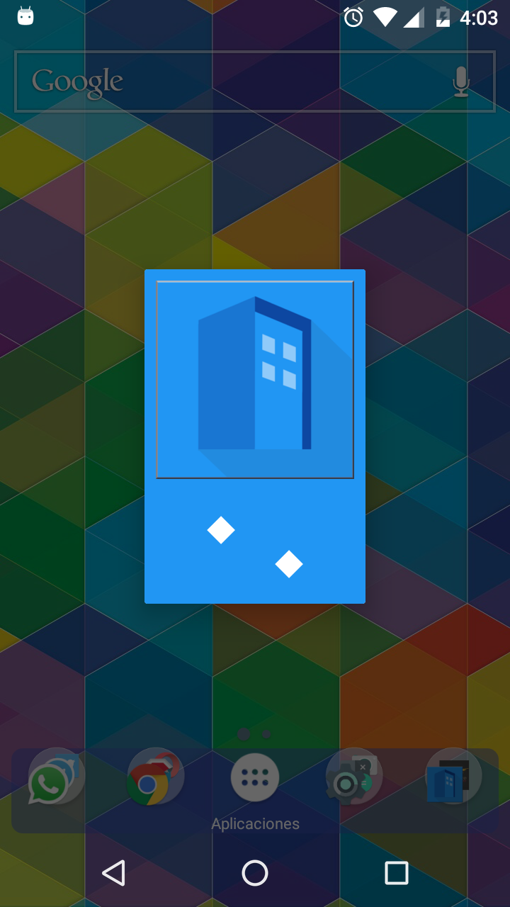

**Usuario:**
Administrador y vecinos.

**Objetivo:**
Recuperar los datos del usuario con una sesión iniciada anteriormente, en caso de existir.

**Descripción:**
Pantalla en modo diálogo que muestra el logo de la aplicación y un icono de carga, dando a entender al usuario que se están realizando las operaciones previas necesarias al uso de la aplicación, como recuperar los datos del usuario ya conectado en la aplicación, en caso de que lo huebiera. En caso de no existir dicha sesión con anterioridad, esta pantalla debería durar no más de un segundo.


##### Inicio de sesión
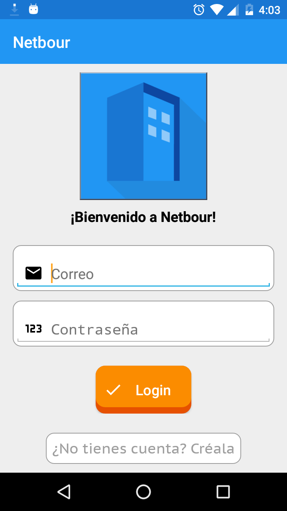

**Usuario:**
Administrador y vecinos.

**Objetivo:**
Iniciar sesión en la aplicación con una cuenta ya existente.

**Descripción:**
Pantalla de inicio de sesión para que el usuario pueda entrar en la aplicación, dada una cuenta existente, accediendo a los distintos apartados de la misma. La pantalla cuenta con campos de texto para ingresar el correo electrónico y la contraseña con la que se ha realizado la contraseña, y un botón para dirigirse a la pantalla de registro de usuario en caso de no disponer de ninguna.

##### Registro de usuario
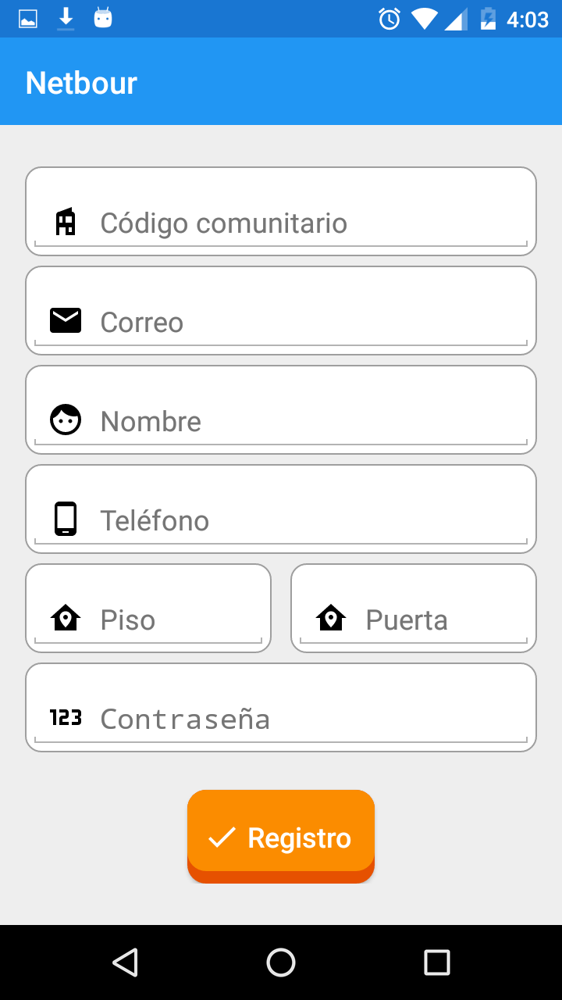

**Usuario:**
Vecinos.

**Objetivo:**
Creación de una nueva cuenta de usuario.

**Descripción:**
Pantalla de creación de usuarios, pensada para los vecinos, de forma que puedan crear un usuario vinculado a un código de comuinidad para acceder a sus apartados. Esta pantalla cuenta con siete apartados a rellenar, todos obligatorios, como son el código de la comunidad, el correo electrónico para el inicio de sesión, nombre del usuario, teléfono, vivienda y la contraseña a asignar al correo electrónico. Todos estos campos tienen restricciones de tamaño, indicando la cantidad mínima o máxima de caracteres en caso de haberse sobrepasado. Además de eso, ninguno de ellos, salvo el correo electrónico, que debe cumplir un formato de correo correcto, tiene restricciones en cuanto a formato o caracteres, permitiendo incluso el uso de emoticonos.

##### Menú


**Usuario:**
Administrador y vecinos.

**Objetivo:**
Acceder a los distintos apartados de la aplicación.

**Descripción:**
Apartado global a todos los apartados de la aplicación, que permite al usuario seleccionar la sección a la que quiere acceder, como el menú principal de secciones, el perfil del usuario, los ajustes de la aplicación, la información de la comunidad, información del autor de la aplicación y una opción para el cierre de la sesión y el cierre de la aplicación.

##### Perfil
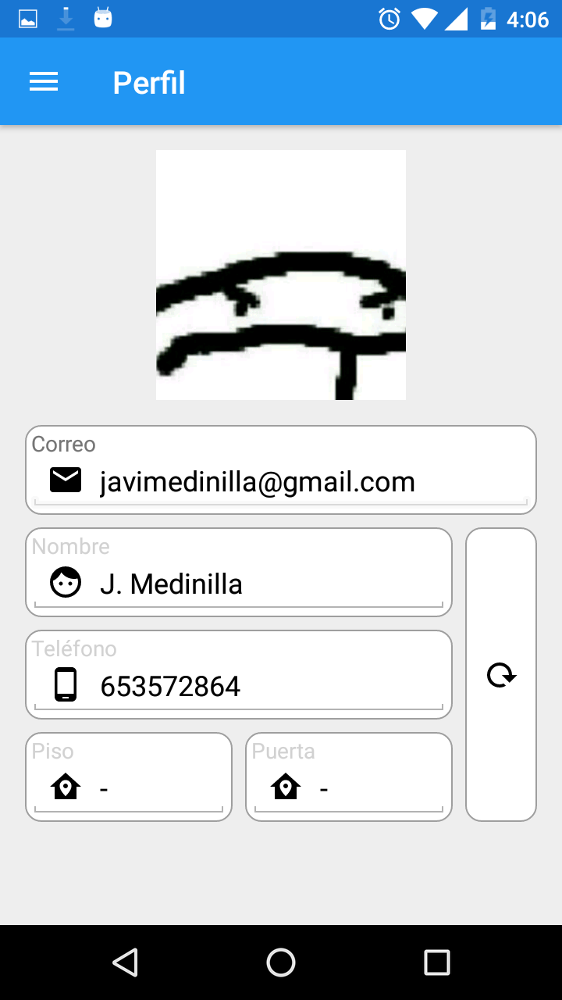

**Usuario:**
Administrador y vecinos

**Objetivo:**
Editar información personal

**Descripción:**
Apartado de la aplicación que permite a los distintos usuarios observar sus propios datos, como el avatar, el correo electrónico, nombre, teléfono y vivienda, permitiendo también la edición de todos estos apartados, exceptuando el correo, que es totalmente invariable, incluído en este apartado únicamente por información.

##### Acerca de
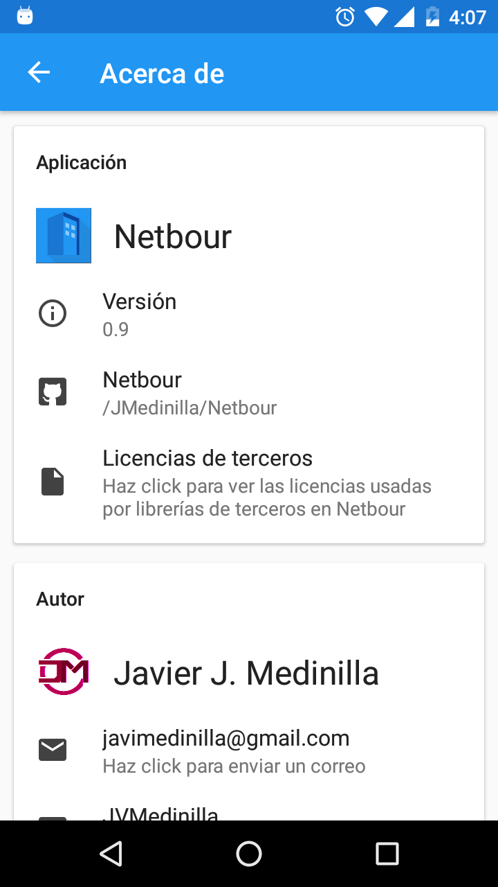

**Usuario:**
Usuarios con acceso al proyecto integrado (apartado no incluído en versión comercial).

**Objetivo:**
Acceder a la información relevante de la aplicación y el desarrollador de la misma.

**Descripción:**
Actividad extra de la aplicación para la versión de presentación como Proyecto Integrado, mostrando información de la aplicación, como su logo, nombre, versión, repositorio y librerías en uso, asó como información del desarrollador de la aplicación, como su correo electrónico, página web y perfiles sociales.

##### Información
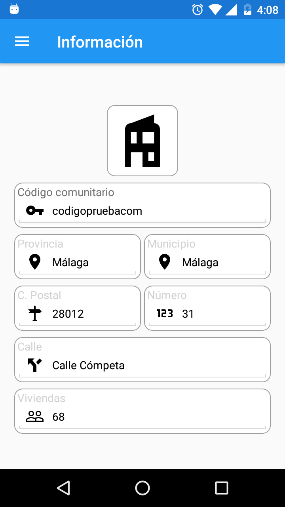

**Usuario:**
Administrador y vecinos.

**Objetivo:**
Mostrar información de la comunidad de vecinos.

**Descripción:**
Apartado de la aplicación que muestra, tanto a los vecinos, al ser su comunidad, como al administrador, en caso de tener alguna seleccionada, información de la misma, mostrando datos como el código comunitario usado durante el registro, la localización de la comunidad, indicando su provincia y localidad, el código postal, calle en la que se encuentra, su número, y la cantidad de viviendas con las que cuenta la comunidad.

##### Licencias de terceros
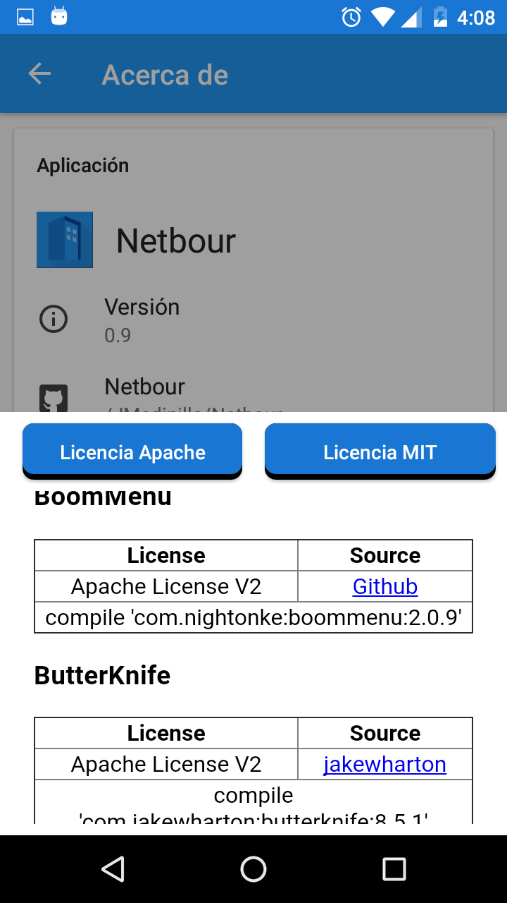

**Usuario:**
Usuarios con acceso al apartado de información de la aplicación.

**Objetivo:**
Mostrar las librerías de terceros usadas en el desarrollo del proyecto.

**Descripción:**
Diálogo adicional que muestra a los usuarios todas las librerías utilizadas en el desarrollo de la aplicación, tanto sus nombres, como el repositorio e incluso la línea de compilación que corresponde a la mencionada librería dentro del proyecto. Esta lista cuenta, además, con ejemplos de las licencias Apache y MIT, siendo estas todas las utilizadas por las íbrerías añadidas a la aplicación.

##### Comunidades
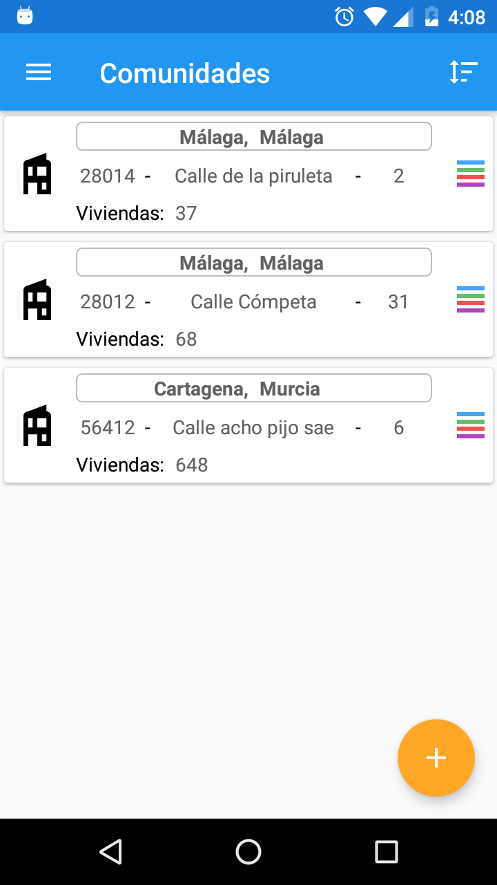

**Usuario:**
Administrador.

**Objetivo:**
Visualizar y manejar la lista de comunidades en uso por los usuarios administradores.

**Descripción:**
Lista de comunidades con las que cuenta el usuario administrador, permitiendo la visualización de todas y el manejo de las mismas mediante las opciones de menú contextual que acompañan a cada elemento de la lista. Esta vista cuenta con una opción para ordenar la lista mediante distintos atributos de los elementos y un botón extra para añadir nuevos elementos, accediendo a un formulario.

##### Comunidades (formulario)
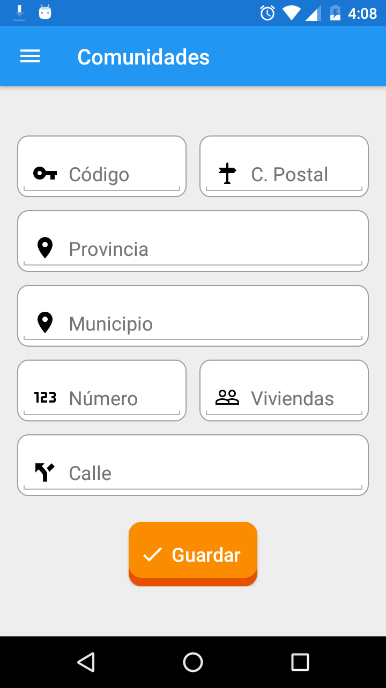

**Usuario:**
Administrador.

**Objetivo:**
Crear o modificar una comunidad.

**Descripción:**
Vista de la aplicación que permite, añadir si se accede desde el botón de la lista, o editar una comunidad si se accede mediante la opción contextual de un elemento de la lista de comunidades. Este formulario cuenta con los campos necesarios para una comunidad, que son un código de registro para que los usuarios puedan acceder a ella, y a como campos informativos, el código postal, la provincia, el municipio, la calle, el número y la cantidad de viviendas de las que dispone la comunidad. Todos estos campos son obligatorios y cuentan con limitadores de tamaño, tanto mínimos como máximos, y no disponen, ninguno de ellos, de carácteres censurados, permitiendo incluso añadir emoticonos.

##### Incidencias
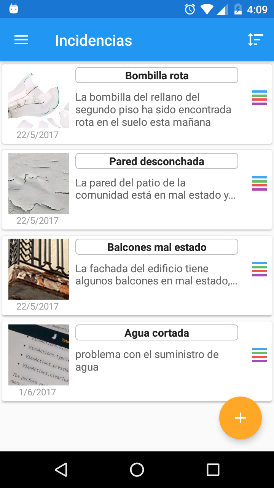

**Usuario:**
Administrador y vecinos.

**Objetivo:**
Visualizar y manejar la lista de incidencias de la comunidad.

**Descripción:**
Lista de incidencias con las que cuenta la comunidad de vecinos, permitiendo la visualización de todas y el manejo de las mismas mediante las opciones de menú contextual que acompañan a cada elemento de la lista. Esta vista cuenta con una opción para ordenar la lista mediante distintos atributos de los elementos y un botón extra para añadir nuevos elementos, accediendo a un formulario.

##### Incidencias (formulario)
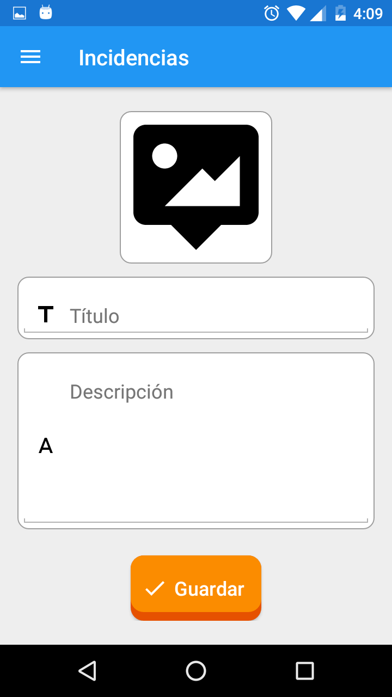

**Usuario:**
Administrador y vecinos.

**Objetivo:**
Crear o modificar una incidencia.

**Descripción:**
Vista de la aplicación que permite, añadir si se accede desde el botón de la lista, o editar una incidencia si se accede mediante la opción contextual de un elemento de la lista de incidencias. Este formulario cuenta con los campos necesarios para una incidencia, que son un título, una descripción y una fotografía. Todos estos campos son obligatorios y cuentan con limitadores de tamaño, tanto mínimos como máximos, y no disponen, ninguno de ellos, de carácteres censurados, permitiendo incluso añadir emoticonos.

##### Menú contextual
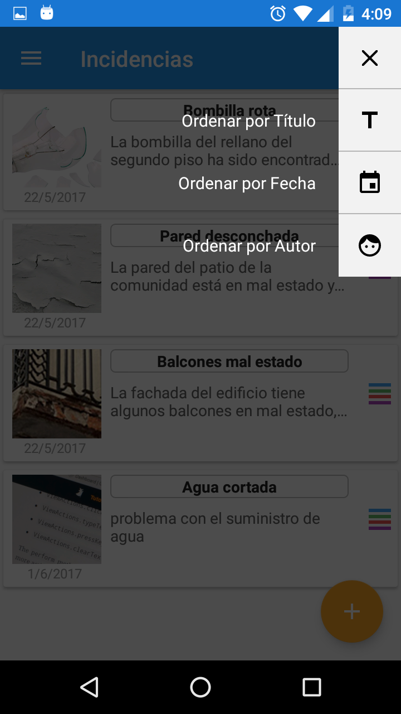

**Usuario:**
Administrador y vecinos.

**Objetivo:**
Usar las opciones para ordenar las listas.

**Descripción:**
Opciones de orden para cada una de las listas de la aplicación, contando en cada una, con atributos específicos según el tipo de elementos que podamos encontrar en ese apartado. Estas opciones ordenarán todos los elementos de la lista de formna ascendente primero y de forma descendente en caso de pulsar otra vez sobre la misma opción. Estas opciones de orden no se muestran al usuario de ninguna forma informativa, presuponiendo que el propio orden será fácilmente visible mediante los propios elementos de la lista.

##### Documentos
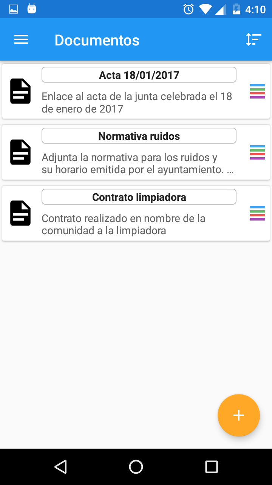

**Usuario:**
Administrador y vecinos.

**Objetivo:**
Visualizar y manejar la lista de documentos de la comunidad.

**Descripción:**
Lista de documentos con las que cuenta la comunidad de vecinos, permitiendo la visualización de todas y el manejo de las mismas mediante las opciones de menú contextual que acompañan a cada elemento de la lista. Esta vista cuenta con una opción para ordenar la lista mediante distintos atributos de los elementos y un botón extra para añadir nuevos elementos, accediendo a un formulario.

##### Documentos (formulario)
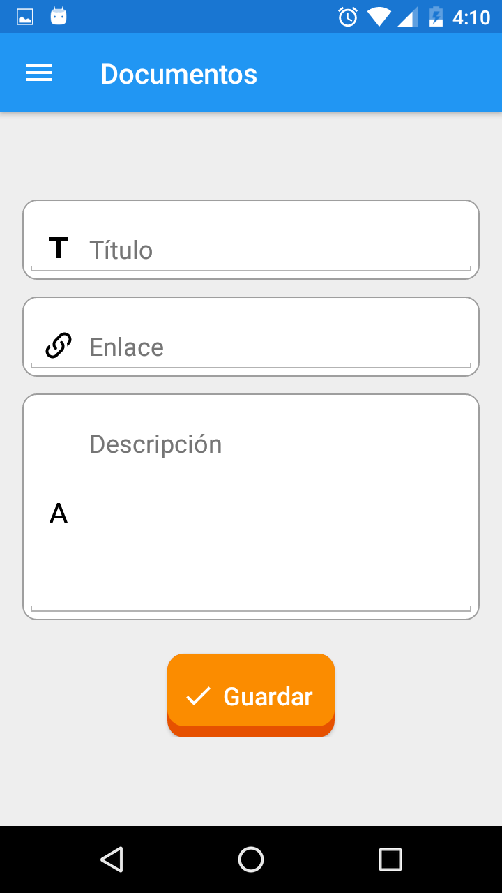

**Usuario:**
Administrador y vecinos.

**Objetivo:**
Crear o modificar un documento.

**Descripción:**
Vista de la aplicación que permite, añadir si se accede desde el botón de la lista, o editar un documento si se accede mediante la opción contextual de un elemento de la lista de documentos. Este formulario cuenta con los campos necesarios para un documento, que son un título, una descripción y un enlace externo. Todos estos campos son obligatorios y cuentan con limitadores de tamaño, tanto mínimos como máximos, y no disponen, ninguno de ellos, de carácteres censurados, permitiendo incluso añadir emoticonos.

##### Tablón
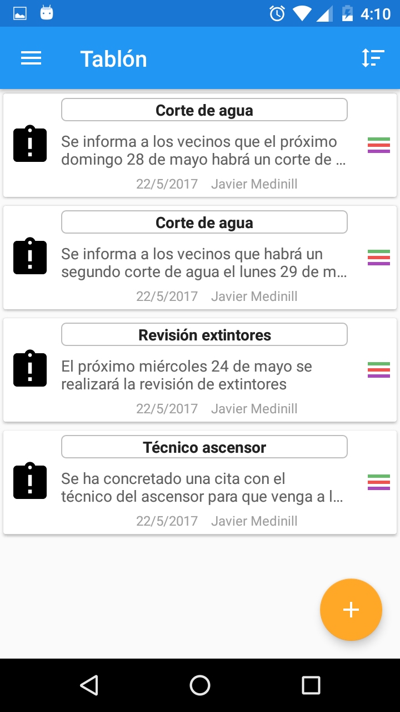

**Usuario:**
Administrador y vecinos.

**Objetivo:**
Visualizar y manejar la lista de entradas de la comunidad.

**Descripción:**
Lista de entradas con las que cuenta la comunidad de vecinos, permitiendo la visualización de todas y el manejo de las mismas mediante las opciones de menú contextual que acompañan a cada elemento de la lista. Esta vista cuenta con una opción para ordenar la lista mediante distintos atributos de los elementos y un botón extra para añadir nuevos elementos, accediendo a un formulario.

##### Tablón (formulario)


**Usuario:**
Administrador y vecinos

**Objetivo:**
Crear o modificar una entrada.

**Descripción:**
Vista de la aplicación que permite, añadir si se accede desde el botón de la lista, o editar una entrada si se accede mediante la opción contextual de un elemento de la lista de entradas. Este formulario cuenta con los campos necesarios para una entrada, que son un título y una descripción. Todos estos campos son obligatorios y cuentan con limitadores de tamaño, tanto mínimos como máximos, y no disponen, ninguno de ellos, de carácteres censurados, permitiendo incluso añadir emoticonos.

##### Juntas
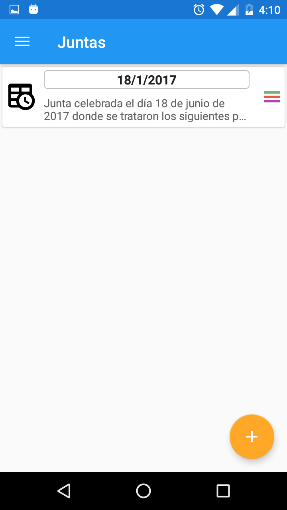

**Usuario:**
Administrador y vecinos.

**Objetivo:**
Visualizar y manejar la lista de juntas de la comunidad.

**Descripción:**
Lista de juntas con las que cuenta la comunidad de vecinos, permitiendo la visualización de todas y el manejo de las mismas mediante las opciones de menú contextual que acompañan a cada elemento de la lista. Esta vista cuenta con una opción para ordenar la lista mediante distintos atributos de los elementos y un botón extra para añadir nuevos elementos, accediendo a un formulario.

##### Juntas (formulario)
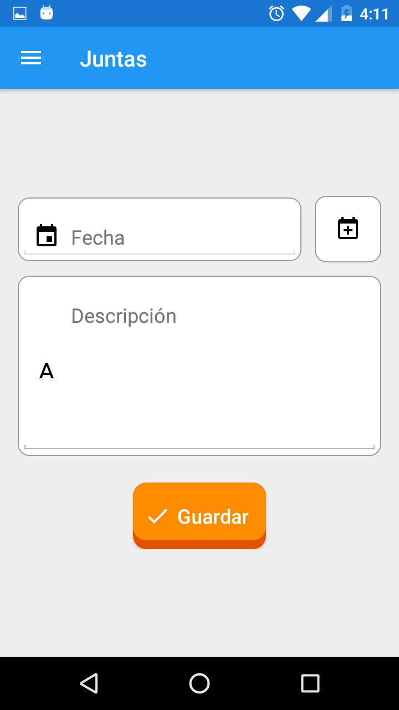

**Usuario:**
Administrador y vecinos.

**Objetivo:**
Crear o modificar una junta.

**Descripción:**
Vista de la aplicación que permite, añadir si se accede desde el botón de la lista, o editar una junta si se accede mediante la opción contextual de un elemento de la lista de juntas. Este formulario cuenta con los campos necesarios para una junta, que son una fecha y una descripción. Todos estos campos son obligatorios y cuentan con limitadores de tamaño, tanto mínimos como máximos, y no disponen, ninguno de ellos, de carácteres censurados, permitiendo incluso añadir emoticonos.

##### Usuarios
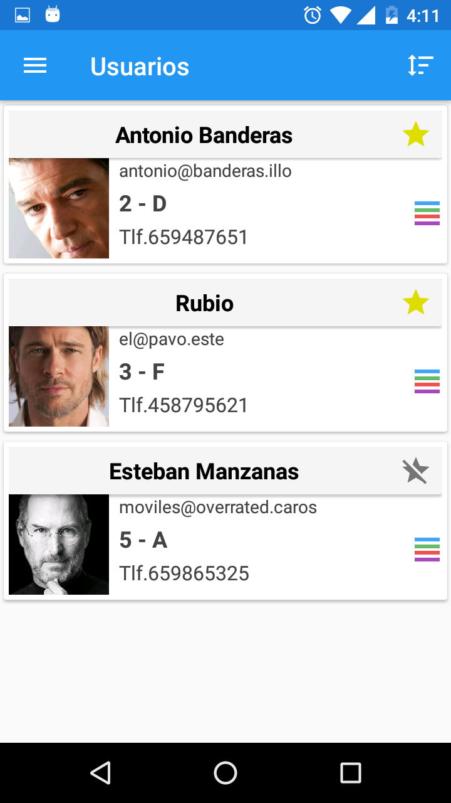

**Usuario:**
Administrador y vecinos.

**Objetivo:**
Visualizar y manejar (administrador) la lista de usuarios de la comunidad.

**Descripción:**
Lista de usuarios con las que cuenta la comunidad de vecinos, permitiendo la visualización de todas y el manejo de las mismas mediante las opciones de menú contextual que acompañan a cada elemento de la lista. Esta vista cuenta con una opción para ordenar la lista mediante distintos atributos de los elementos y un botón extra para añadir nuevos elementos, accediendo a un formulario.

##### Opciones


**Usuario:**
Administrador y vecinos.

**Objetivo:**
Opciones contextuales de los elementos de cada lista.

**Descripción:**
Opciones de menú contextual para cada elemento de la lista. Estas opciones varían, tanto en opciones como tal, o en funcionalidad según el usuario que las utilice. Los elementos con fotografía como las incidencias o los usuarios cuentan con una opción de ampliación de la misma, las comunidades tienen una cuarta opción para que el administrador pueda seleccionar su código y acceder a sus elementos, y todas las listas cuentan con opciones para editar, eliminar o reportar el elemento pulsado. La funcionalidad de estas opciones también se verán modificadas, advirtiendo al usuario de que no tiene permisos para editar o eliminar los distintos elementos si no es un usuario administrador o el propio autor del elemento seleccionado. La opción de reporte permite al usuario enviar un correo electrónico a las direcciones de correo de los administradores de la comunidad.

##### Permisos
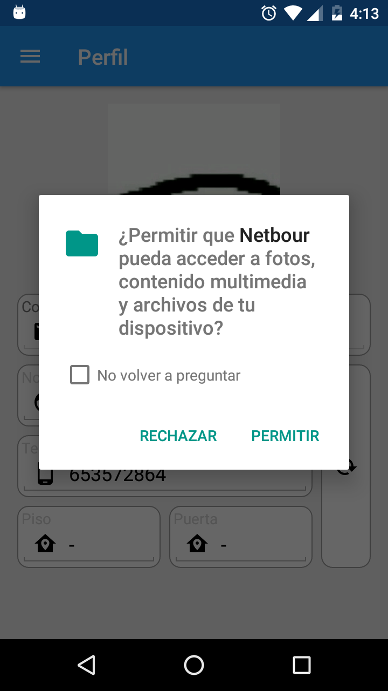

**Usuario:**
Administrador y vecinos.

**Objetivo:**
Conceder los permisos necesarios para la acción.

**Descripción:**
Diálogo de permisos para pedir al usuario que los conceda, antes de acceder a la funcionalidad que los necesita. En este caso la aplicación cuenta únicamente con un permiso para leer la memoria externa del dispositivo, de forma que el usuario pueda agregar una fotografía como avatar o a una incidencia de la comunidad.

##### Edición
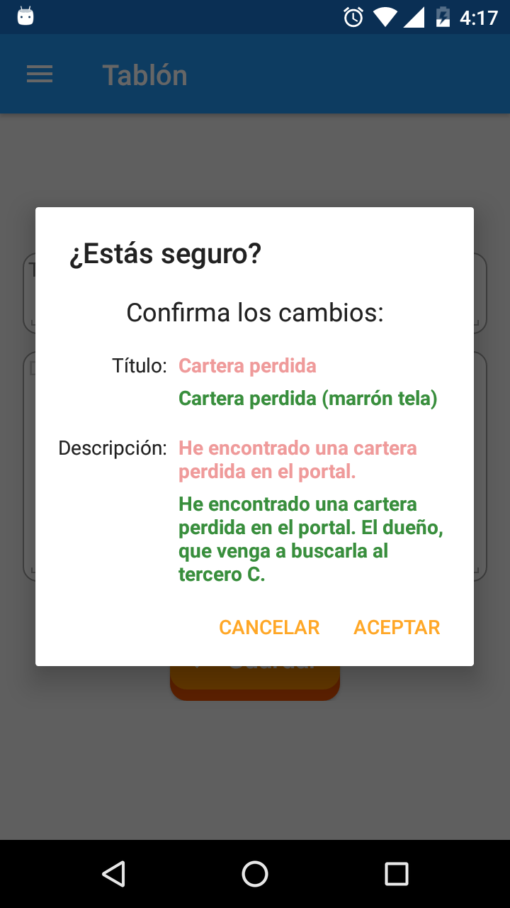

**Usuario:**
Administrador y vecinos.

**Objetivo:**
Mostrar un diálogo informativo con los cambios realizados.

**Descripción:**
Cuadro de diálogo que disponen los distintos formularios de la aplicación para mostrar al usuarios los cambios realizados sobre el elemento de la lista, esperando la confirmación de los mismos para ser guardados, mostrando en rojo el valor anterior, en verde el valor nuevo y en gris ambos valores en caso de que dicho atributo no hubiera recibido ninguna modificación.

## Código fuente relevante

- **[EN CONSTRUCCIÓN]**

## Conclusiones del proyecto

Para concluir con la documentación de este proyecto llegamos a las conclusiones del mismo, exponiendo la evolución del propio proyecto a lo largo de los meses que ha durado su desarrollo.

En un principio, sí que es cierto que el tiempo disponible para el desarrollo del proyecto, no es espcialmente corto, pero teniendo en cuenta que su desarrollo coincide con las prácticas en las distintas empresas, se convierte en un tramo especialmente angosto del camino hacia el final del curso. Por eso mismo, me gustaría expresar gratitud y elogiar la iniciativa de Lourdes para dar comienzo a los proyectos de cada uno desde el primer mes de clase, cuando se nos pidieron las primeras entregas, necesitando idear un anteproyecto y un análisis para la base de datos para el mismo mes de octubre. Y aunque ese trabajo realizado entonces no muestra más que la idea del proyecto, ya que ha cambiado su planteamiento muchas veces a lo largo de los meses, cierto es que ha permitido comenzar el proyecto en abril a un ritmo de vértigo, teniéndola prácticamente finalizada a finales de mayo, resultado con el que quedo más que satisfecho.

A la hora de la programación, el modelo presentador (e interactor, como lo he implementado yo) me ha permitido realizar un avance excelentemente eficiente, ahorrándome suficiente tiempo como para no haber tenido que dedicar nada más que los fines de semana para el desarrollo de la aplicación, aunque esto ha sido también facilitado especialmente gracias a Firebase, que me ha ahorrado todo el trabajo necesario para el servidor, dándome un almacenamiento, una base de datos, autentificaciones y una API al momento de vincular la aplicación con el servidor de Google. Cierto es, que a diferencia de como hubiera sido con una base de datos SQL y en mi propio servidor, habría conseguido un proyecto más personal, con funciones mucho más específicas y útiles además de una estructura con claves ajenas, bastante mejor que la estructura JSON en la que se basa la aplicación, pero todo el tiempo ahorrado y la simplicidad que Firebase me ha ofrecido, ha sido considerada como una ventaja a tomar muy en cuenta por delante de una API personalizada.

Gracias al modelo presentador, la anticipación de Lourdes para el diseño del proyecto, y las ventajas de Firebase, la temporalización del proyecto se ha podido cumplir e incluso superar en horas de trabajo, aunque las distintas funciones no han sido desarrolladas en el mismo orden que esta refleja. El diseño de la base de datos ha sido una tarea tediosa, especialmente teniendo en cuenta la estructura que sigue Firebase, pero una vez concluída, el resto del proyecto ha ido cuesta abajo, desarrollando cada parte de la aplicación sin interrupciones, y sin tener que realizar muchos cambios que pudieran retrasar el desarrollo.

En cuanto al propio código, se ha seguido una estructuración absolutamente estricta, favoreciendo la limpieza, los posibles cambios y el mantenimiento a la hora de revisar el propio código en el futuro. La estructuración en cuanto a actividades y fragmentos ha sido detallada extensamente en borradores, para evitar siempre, en todo momento, cualquier tipo de problema que no tuviera una solución concisa y rápida, aunque los pequeños fallos son siempre inevitables. La refactorización de las clases se realiza al mismo tiempo que el desarrollo, dejando atrás un cñodigo perfectamente ordenado durante el propio avance, siguiendo la prioridad en cuanto a las posiciones de cada uno de los métodos que se muestra a continuación:

1. Constantes
2. Componentes de la interfaz
3. Instancias de objetos, Variables de tipos primitivos
4. Interfaces
5. onAttach, onCreate, onCreateView, onViewCreated, onActivityCreated
6. onStart, onResume
7. onPause, onStop
8. onCreateOptionsMenu, onCreateItemSelected
9. onDestroyView, onDestroy, onDetach
10. onActivityResult, onRequestPermissionsResult
11. Métodos Override de las interfaces implementadas, ordenados alfabéticamente
12. Métodos de la propia clase, ordenados alfabéticamente

En cuanto a las funcionalidades que quedan por implementar, que hubiera apreciado poder incluir, y que quedan en la lista de espera para el futuro, serían las siguientes:

- Apartado para gestionar las reservas de las zonas comunes de la comunidad, en caso de haberlas
- Gráficas e información de la eficiencia a la hora de resolver incidencias
- Creación de una API propia en un servidor dedicado
- Implementación de conversaciones privadas entre vecinos o de comunicación directa con el administrador
- Inicio de sesión mediante Google
- Inclusión de pequeños juegos simples para el entretenimiento

Mientras que otros apartados que se esperan a lo largo del futuro, bastante más importantes que las funcionalidades descritas anteriormente, serían:

- Traducción de todo el código de la aplicación de Java a **Kotlin**
- Versión para iOS en **Swift**
- Versión web

## Apéndice

Para concluir, agradecimientos y menciones especiales:

Profesores del centro y del ciclo formativo que han colaborado directamente en el aprendizaje y proporcionado los apuntes necesarios para la creación del proyecto final:

- **Lourdes Rodríguez**, **Eliseo Moreno**, **Sebastián Millán**, **Francisco García**, **Pablo Blanco**, **Guillermo Raya**, **José María Baez**, **Isabel Quirantes** y **Francisco Javier Moya**.

Tutores laborales en la empresa seleccionada para las prácticas:

- **Cristian Paciencia**, jefe del equipo de Movilidad y **Enrique Ríos**, como persona directamente asignada para mi seguimiento dentro de la empresa. Agradecimientos también por ser los impulsores del estudio de Firebase, cambiando por completo el rumbo de mi proyecto.

Autor del diseño original del logo de la aplicación y la traducción al catalán de la misma:

- **Oriol Monte I Gomez**, estudiante en la Universidad de Girona.


## Bibliografía

A continuación se detallan las principales páginas web que han sido de utilidad a lo largo del desarrollo del proyecto integrado:

El mejor tutorial de toda la web para aprender Firebase en tan solo un par de horas, mientras desarrollas un chat en tiempo real:

- **Firebase in a Weekend (Android)** -> https://classroom.udacity.com/courses/ud0352

Página web de Fireabse, herramienta de alojamiento de la base de datos de la aplicación:

- **Firebase** -> https://firebase.google.com

Repositorio de código usado para alojar el proyecto:

- **Github** -> https://github.com/

Páginas web para consultas y tutoriales de funcionalidades concretas:

- **StackOverflow** -> http://stackoverflow.com/

- **SGOliver** -> http://www.sgoliver.net/

- **Hermosa Programación** -> http://www.hermosaprogramacion.com/

Sitio web del cual se han obtenido todos los iconos de la aplicación:

- **Material Design Icons** -> https://materialdesignicons.com/

Web para consultar los detalles de las licencias disponibles, donde se ha obtenido toda la información de las licencias Apache y MIT, presentes en las librerías utilizadas para la aplicación:

- **tl;drLegal** -> https://tldrlegal.com/

Repositorio concreto del cual han sido recopiladas la inmensa mayoría de las librerías utilizadas en el proyecto integrado:

- **Awesome Android UI** -> https://github.com/wasabeef/awesome-android-ui

Librería para la inyección de componentes de la interfaz:

- **Butter Knife** -> http://jakewharton.github.io/butterknife/

Librería para la carga de imágenes asíncrona desde una dirección web:

- **Glide** -> https://github.com/bumptech/glide